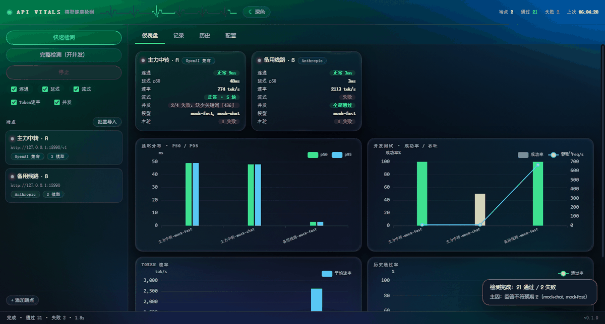
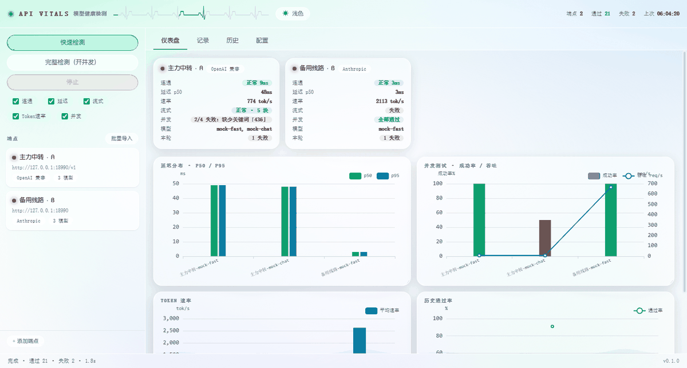
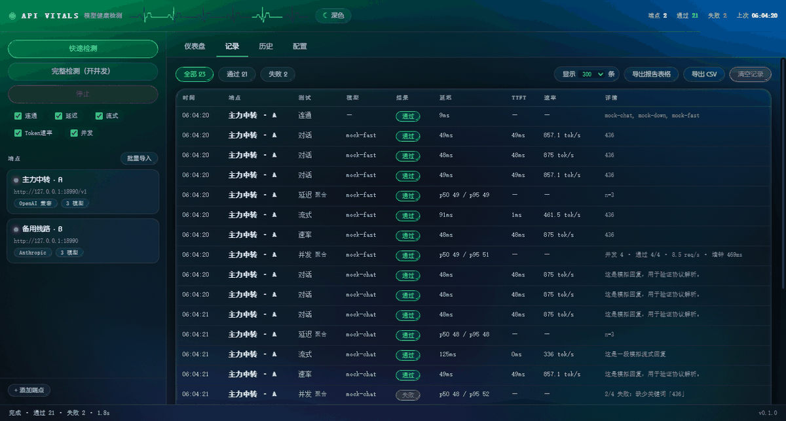
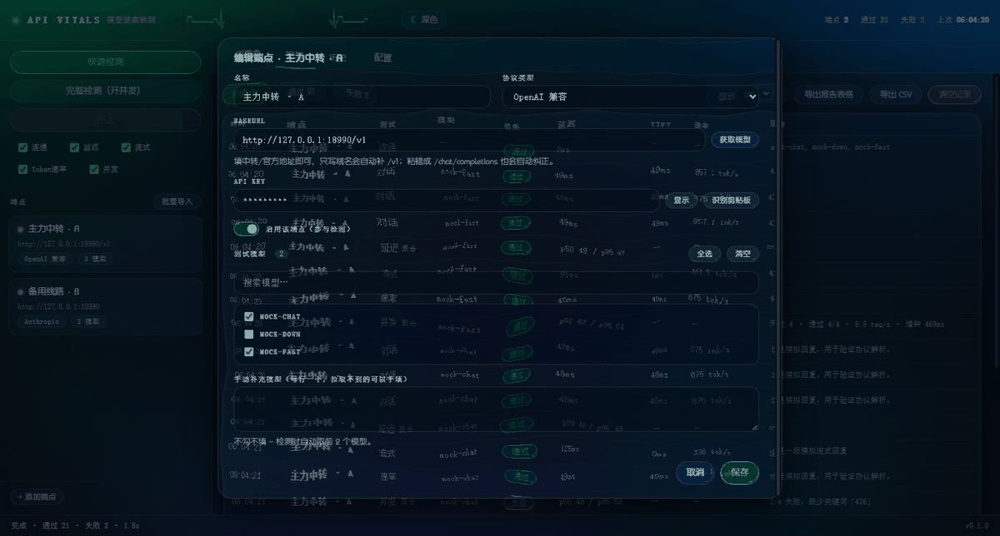
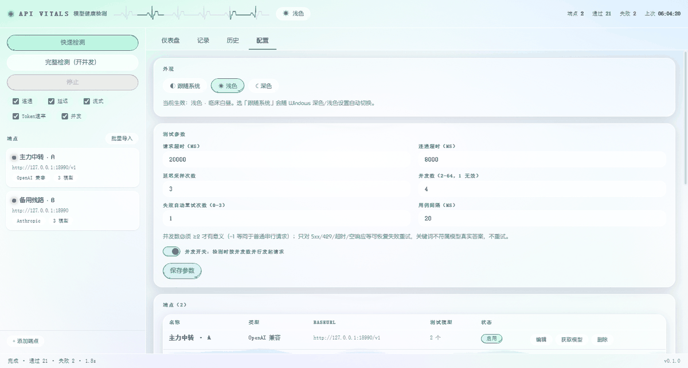

# API 模型健康检测 · API VITALS

> AI 中转 / 官方 API 的**批量体检台**：一次点检多个端点与模型，测连通、延迟、流式、Token 速率、并发，出报告。

## 这是什么

你手上有几个 AI 中转站、几十个模型名，但不清楚**哪些真的能用、哪个快、哪个会限流、Key 有没有过期**。
这个工具把它们一次性拉出来跑体检，把结果变成可导出的表格。

- **Windows 桌面版**（`winapp/`）：C# WinForms + WebView2 单文件 exe，液态玻璃界面，深浅双主题
- **MiniApp 版**（仓库根目录）：AppUI Python 实现，手机端 3 Tab（测试 / 聊天 / 配置）

## 功能

| 检测项 | 说明 |
|---|---|
| **连通** | 拉 `/models` 验证 BaseURL + Key 是否可用 |
| **对话** | 非流式请求，校验返回内容与预期关键词 |
| **延迟** | 多次采样取 p50 / p95 |
| **流式** | SSE 逐块接收，测 TTFT、分块数、是否正常收尾 |
| **Token 速率** | tok/s 或 char/s |
| **并发** | 固定并发数一次性压测，测成功率、吞吐、墙钟耗时 |

其他：

- **四类协议适配**：OpenAI 兼容 / Anthropic / Gemini / 自定义 HTTP
- **批量导入端点**，支持粘贴 JSON、`名称|类型|URL|Key` 多种格式
- **剪贴板识别**：新建端点时自动识别剪贴板里的 URL + Key 并提示填入
- **一键拉取模型**，勾选要测的模型（带搜索过滤）
- **报告导出 CSV**：端点汇总（含 API 地址、Key、成功模型 / 失败模型）、逐模型结果、用例明细、并发测试
- **失败归因**：自动把失败归类为「回答不符预期 / 空响应 / 超时 / 限流 / 上游 5xx / 鉴权」并指出受影响模型
- **自动重试**：只重试可恢复失败（5xx、429、超时、被截断），关键词不符不重试
- **右键菜单**：端点上右键可编辑 / 单独检测 / 拉模型 / 复制配置；记录行、历史、图表、空白处各有菜单
- **液态玻璃 UI**：SVG 位移折射 + 流动液态背景，日夜双主题

## 界面

### 深色 · 监护室夜间



### 浅色 · 临床白昼



### 记录与报告



### 端点编辑（含获取模型）



### 配置页



## 快速开始

### 桌面版

需要 .NET 10 桌面运行时（框架依赖发布）。

```bash
cd winapp
bash build.sh          # 产物：winapp/dist/ApiHealth.exe
```

或直接从 Releases 下载 `ApiHealth.exe` 双击运行。

首次使用：
1. 点左侧「+ 添加端点」，或「批量导入」一次加一批
2. 填 Name / BaseURL / API Key（新建时若剪贴板里有连接信息会自动提示填入）
3. 点「获取模型」拉取模型列表，勾选要测的模型
4. 点「快速检测」跑一遍；需要并发压测时打开「并发」开关或点「完整检测」
5. 「记录」页看明细，「导出报告表格」出 CSV

### MiniApp 版

由 AppUI 运行时加载，入口 `main.py`。

## 项目结构

```
.
├── main.py                  # MiniApp 版入口（AppUI，3 Tab）
├── services.py              # MiniApp 版的测试逻辑
├── widgets/home/            # MiniApp 桌面小组件
│
└── winapp/                  # Windows 桌面版
    ├── Program.cs           # 原生壳：开窗、嵌 WebView2、剪贴板桥、日志
    ├── ApiHealth.csproj     # 内嵌 wwwroot 资源，单文件发布
    ├── build.sh             # 交叉构建脚本
    ├── wwwroot/             # 前端（无构建步骤，原生 ESM）
    │   ├── index.html
    │   ├── app.js           # UI 层：状态、渲染、检测编排、右键菜单、报告
    │   ├── engine.js        # 引擎层：4 类协议适配 + 6 种检测（Node 可直接 import）
    │   ├── app.css          # 液态玻璃 + 流动背景 + 双主题
    │   ├── app-font.woff2   # 内置字体（子集化）
    │   └── app.ico
    ├── tools/make_icon.py   # 生成多尺寸图标
    └── test/                # 测试（详见 test/README.md）
```

分层原则：`engine.js` 纯逻辑、不碰 DOM，因此能在 Node 里直接跑单元测试；`app.js` 只管渲染与编排。

## 测试

```bash
cd winapp

node test/test-engine.mjs    # 引擎单元测试（四类协议 × 各检测项）
node test/e2e-ui.mjs         # 端到端（headless 浏览器 + CDP 驱动真实 UI）
node test/audit.mjs          # 计算样式审计（字体是否生效、对比度、浮层定位）
node test/shot.mjs           # 生成深浅主题截图
```

测试脚本**自带静态服务与 mock**，不需要手工起服务。浏览器自动探测
（WSL 找 Windows 侧 Edge/Chrome，Linux 找 chrome/chromium），也可用 `BROWSER_PATH` 指定。

CI（`.github/workflows/test.yml`）在每次推送时跑：引擎单测、UI 端到端、样式审计，
以及 Windows runner 上的客户端构建校验。

## 打包说明

发布为框架依赖单文件，内嵌全部前端资源（含字体与图标），运行时不依赖外部文件：

```bash
dotnet publish -c Release -r win-x64 --self-contained false \
  -p:PublishSingleFile=true -p:IncludeNativeLibrariesForSelfExtract=true -o dist
```

字体子集化：原始字体 23MB，用 `pyftsubset` 子集化到约 1.3MB 后内嵌。

## 许可

MIT
